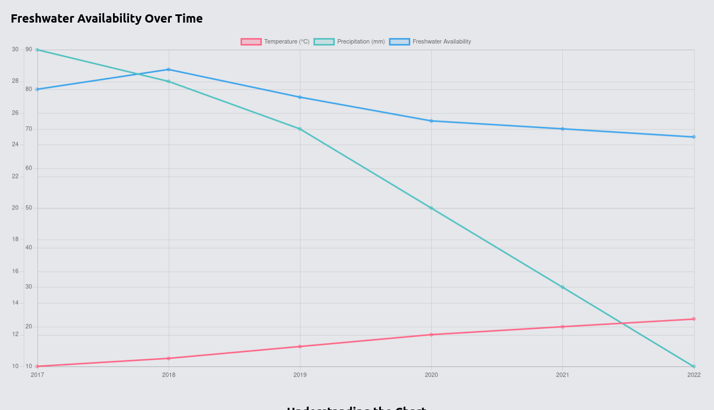
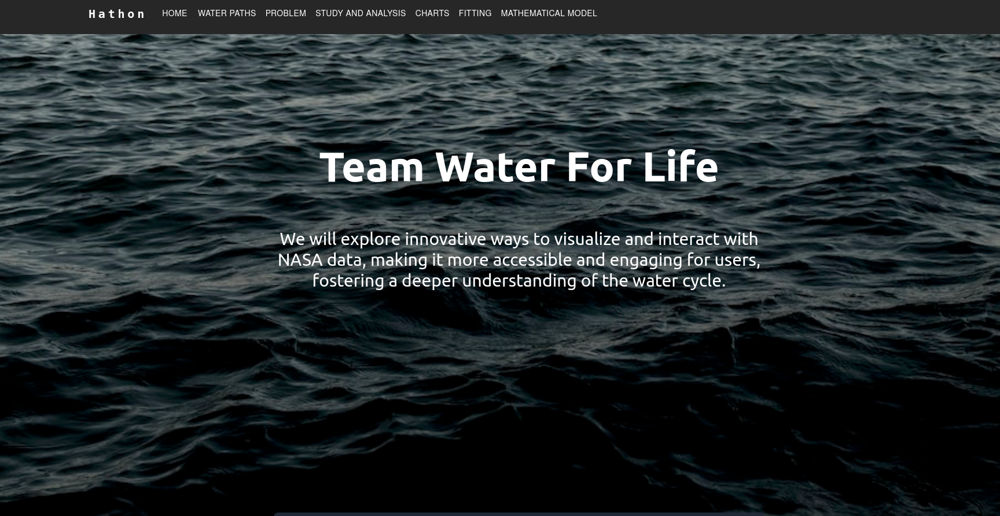

# Everything Starts with Water

## Table of Contents

- [Everything Starts with Water](#everything-starts-with-water)
  - [Table of Contents](#table-of-contents)
  - [Overview](#overview)
  - [Screenshots:](#screenshots)
    - [Key Objectives](#key-objectives)
  - [Technologies Used](#technologies-used)
  - [Folder Structure:](#folder-structure)
  - [Important Information:](#important-information)
  - [Installation](#installation)

## Overview

**Everything Starts with Water** is an educational and interactive web application created for the NASA SpaceApps Hackathon 2023. This project aims to help elementary, middle, and high school students understand the complete path of water across the Earth's entire system and how it's influenced by our changing climate. The application utilizes data from NASA satellites to create engaging visualizations and narratives about the global water cycle.

## Screenshots:




### Key Objectives

- Visualize the complete path of water through the Earth system.
- Demonstrate how these processes change due to planetary warming.
- Educate high school students about climate change's impact on the global water cycle which helps of charts.

## Technologies Used

- **React:** The project is built using React, a popular JavaScript library for building user interfaces.
- **Django:** Made API with django on which the React gets real-time data and plots. It can also be used to get realtime predictions
- **React Router:** Routing within the application is managed using React Router.
- **Tailwind CSS:** For clean, responsive, and efficient UI design.
- **Chart.js:** To create interactive and informative data visualizations.
- **NASA Data:** Utilizing NASA's satellite data to enrich the content.
- **Python:** Made different plots, regression fitting, prediction through python in .ipynb files

## Folder Structure:

- **frontend:** This contains all the frontend part of the code
- **backend:** This contains django backend code with api app which contains a model which is used to plot in JS.
- **python_codes:** This contains all the codes for the plotting different variables, fitting the linear regression and so on. This is done on .ipynb file
- **matlab_codes:** Folder to the matlab codes.

## Important Information:

- **Python Use**: Used to plot different models and linear equation. One graph is made using Chart.js while other taken through the data analysis plots from the ipynb files.
- **Sources**: Shared through the spaceapps portal
- We have plotted the data through various sources like from climate.nasa.gov etc.
-

## Installation

1. Clone the repository:

   ```bash
   git clone https://github.com/yourusername/everything-starts-with-water.git
   ```
